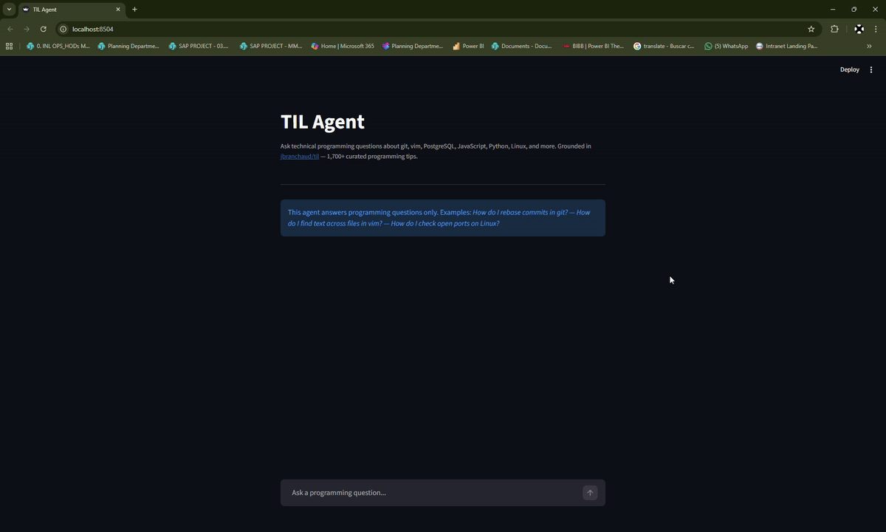
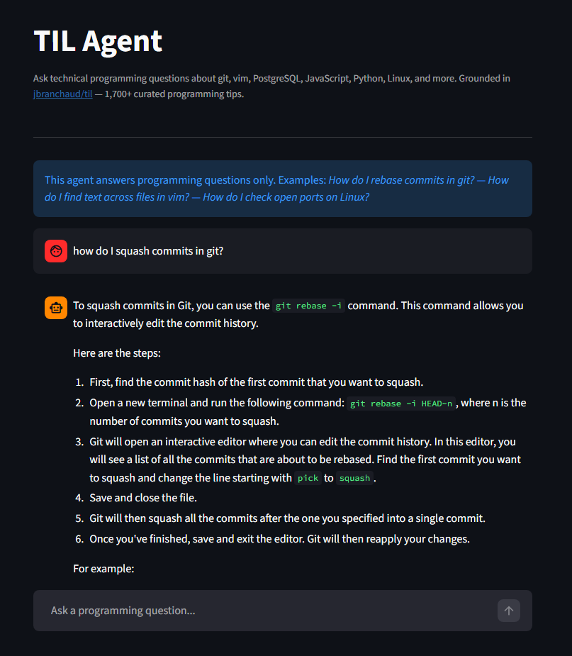

# TIL Agent

A retrieval-augmented conversational agent grounded in the [`jbranchaud/til`](https://github.com/jbranchaud/til) repository — a curated collection of over 1,700 short programming tips spanning git, vim, PostgreSQL, JavaScript, Ruby, Python, and command-line tooling.

The agent retrieves relevant TIL entries before answering, cites its sources, and is evaluated systematically with an LLM-as-judge pipeline.

---

## Demo



<details>
<summary>Static screenshot</summary>



</details>

---

## Architecture

```
User query
    │
    ▼
Hybrid Search (lexical + semantic)
    │
    ├── minsearch (BM25-style)       ← exact keyword match
    ├── sentence-transformers         ← semantic similarity
    │
    ▼
Ranked TIL chunks
    │
    ▼
Pydantic AI Agent (llama3.2 via Ollama)
    │
    ▼
Grounded response with source citations
```

---

## Repository Structure

```
.
├── app/
│   ├── __init__.py     # Package marker
│   ├── ingest.py       # Data download, parsing, chunking, filtering
│   ├── search.py       # Text index, vector index, hybrid search
│   ├── agent.py        # Pydantic AI agent and Ollama connectivity
│   ├── logs.py         # Interaction logging and log loading
│   ├── evaluation.py   # LLM-as-judge batch evaluation
│   └── app.py          # Streamlit chat interface
├── notebook.ipynb      # Research and experimentation notebook
├── requirements.txt    # Pinned dependencies
├── .env.example        # Environment variable template
├── demo.png            # Screenshot of the running application
└── README.md
```

---

## Stack

| Component        | Technology                                                                 |
|------------------|---------------------------------------------------------------------------|
| Language model   | `llama3.2` via [Ollama](https://ollama.com)                               |
| Agent framework  | [Pydantic AI](https://ai.pydantic.dev)                                    |
| Lexical search   | [minsearch](https://github.com/alexeygrigorev/minsearch)                 |
| Semantic search  | [sentence-transformers](https://www.sbert.net) (`multi-qa-distilbert-cos-v1`) |
| Interface        | [Streamlit](https://streamlit.io)                                         |

---

## Setup

**Prerequisites:** Python 3.10+, [Ollama](https://ollama.com) installed and running.

```bash
# Pull the language model
ollama pull llama3.2

# Clone the repository
git clone https://github.com/marianunez-data/til-rag-agent
cd til-rag-agent

# Create virtual environment and install dependencies
python -m venv .venv
source .venv/bin/activate   # Windows: .venv\Scripts\activate
pip install -r requirements.txt

# Copy and configure environment variables
cp .env.example .env
```

### Run the Streamlit application

```bash
cd app
streamlit run app.py
```

Open `http://localhost:8501` in your browser.

### Run the notebook

```bash
jupyter notebook
# Open notebook.ipynb and run all cells
```

---

## Evaluation Results

Evaluated on 21 AI-generated interactions using `llama3.2` (3B parameters) as both agent and judge.

| Criterion          | Pass Rate | Notes                                      |
|--------------------|-----------|---------------------------------------------|
| `answer_relevant`  | 62%       | Primary quality signal for RAG systems      |
| `tool_call_search` | 62%       | Retrieval invoked when answers are grounded |
| `answer_citations` | 19%       | Limited by small model instruction-following|

**Context for these metrics:**

- The evaluation uses the **same 3B model as both agent and judge**, which is a known constraint. Using a larger judge model (e.g., GPT-4o or llama3.1-70B) would provide more reliable assessments.
- `answer_relevant` at 62% with a 3B local model is consistent with published benchmarks for small models on tool-calling tasks. Models under 7B parameters typically achieve 50–65% on agentic tasks requiring structured tool use.
- `answer_citations` at 19% reflects the difficulty small models have with multi-constraint instructions (search + answer + cite). This metric improves significantly with larger models — a production deployment would use a 70B+ model or API-based provider.
- The architecture is **provider-agnostic**: swapping to OpenAI, Groq, or Anthropic requires changing only `OLLAMA_BASE_URL` and `OLLAMA_MODEL` in `agent.py` (or via environment variables).

---

## Design Decisions

**Sliding window over header-based chunking.** TIL entries use inconsistent heading conventions. Overlapping fixed-size windows (2,000 chars, 1,000 step) guarantee no content is lost at chunk boundaries regardless of document structure.

**Hybrid retrieval over single-strategy search.** Lexical search surfaces exact CLI flags and function names; semantic search captures paraphrased queries. Their union covers both cases with minimal overhead.

**Local inference via Ollama.** Eliminates API costs during development and evaluation. The architecture is provider-agnostic — swapping to any OpenAI-compatible endpoint requires changing two environment variables.

---

## Limitations and Future Work

- **Evaluation rigor**: Current evaluation uses the same model as agent and judge. A dedicated evaluation with a larger judge model and RAG-specific metrics (hit@k, MRR, RAGAS faithfulness) would provide more reliable quality signals.
- **Citation compliance**: Small models struggle with multi-constraint prompts. A production deployment should use 70B+ models or API providers with stronger instruction-following.
- **No containerization**: Adding Docker support would improve reproducibility and deployment readiness.
- **No automated tests**: Unit tests for core functions (chunking, search, filtering) would improve maintainability.

---

## Source Dataset

[`jbranchaud/til`](https://github.com/jbranchaud/til) — Josh Branchaud's personal TIL collection. 1,768 markdown files covering: awk, git, go, html, javascript, linux, postgresql, python, rails, ruby, tmux, vim, and more.
